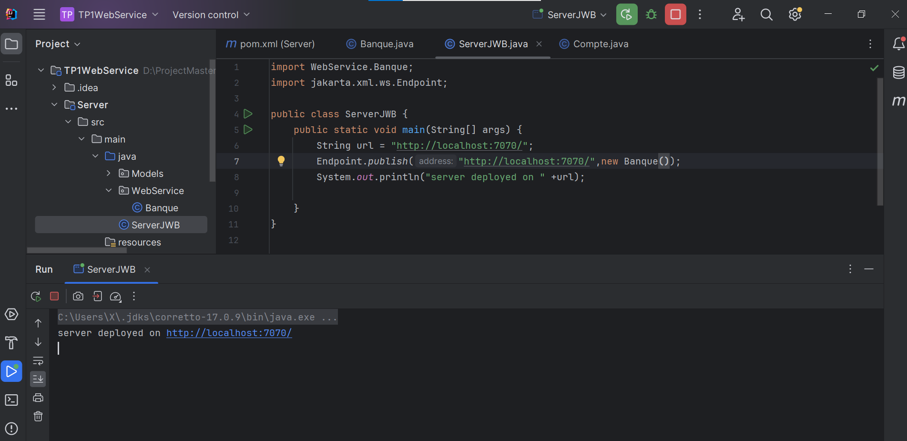

<h2>Activités pratiques web service</h2>

<section>
    <h2>Création du Serveur</h2>
    
Capture d'écran du Serveur:

    
</section>

<section>
    <h2>Test WSDL</h2>
    
</section>

<section>
    <h2>Test des Méthodes avec SOAPUI</h2>
    <ul>
            <li>Convertir un montant de l’euro en DH</li>
            
            <li>Consulter un Compte </li>
            
            <li>Consulter une Liste de comptes </li>
            
    </ul>
</section>

<section>
    <h2>Tests depuis une Interface Client</h2>
    
</section>

